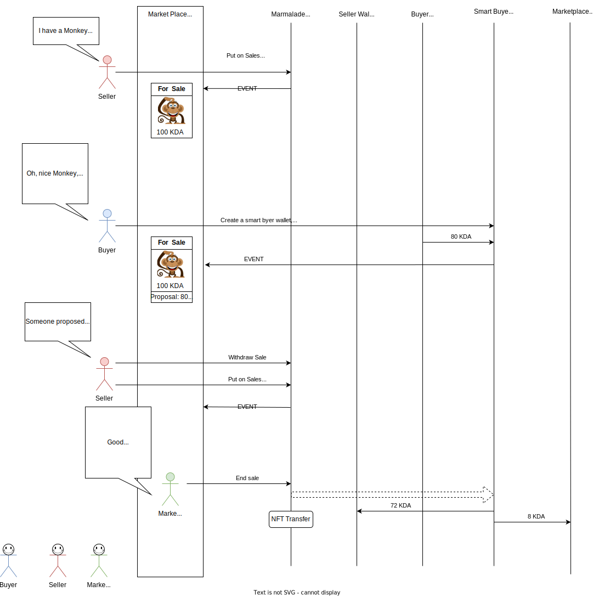
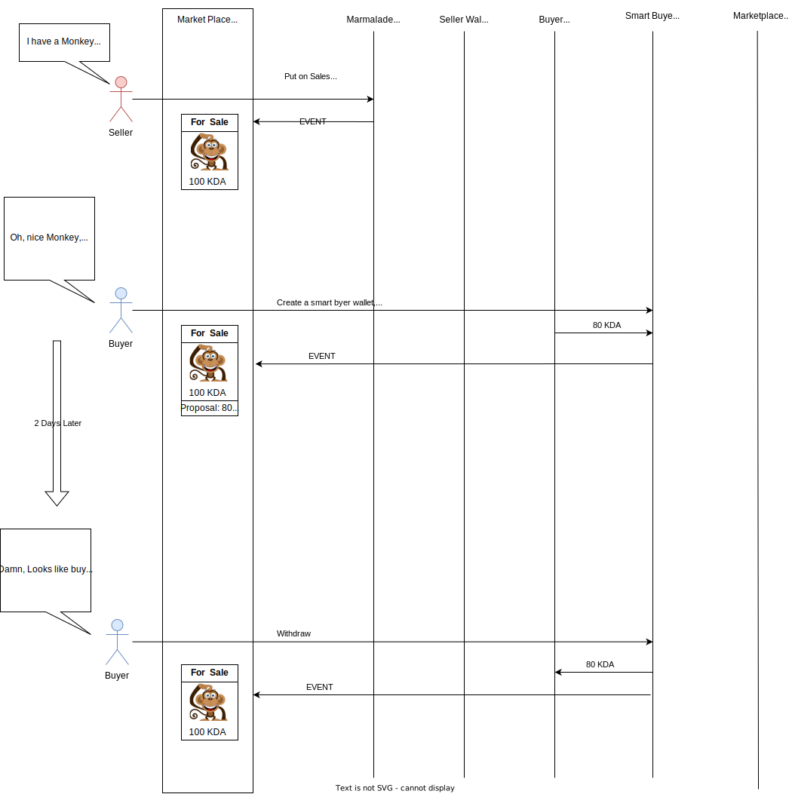
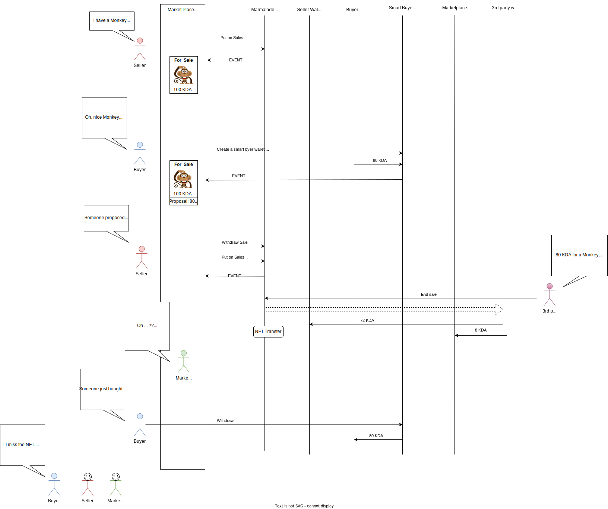
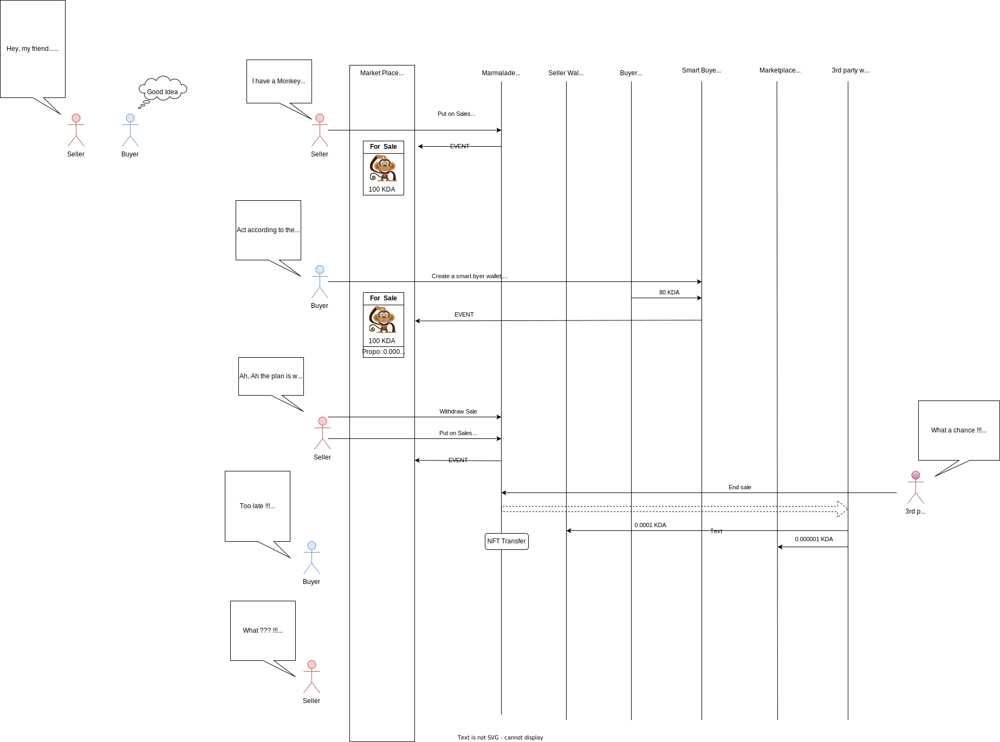

# Marmalade NG - Sales with bid

- Pure on-chain solution
- Works with a current Marmalade-NG with only a small change
   - https://github.com/Marmalade-NG/marmalade-ng/tree/alternate_payer

- Need a *"smart buyer" wallet* implementation: relatively straight forward

## Normal flow

## Alternative 1 => Seller refuses the discount proposal

## Alternative 2 => A third party bought in place of the bidder

## Why this discourage OTC deals

