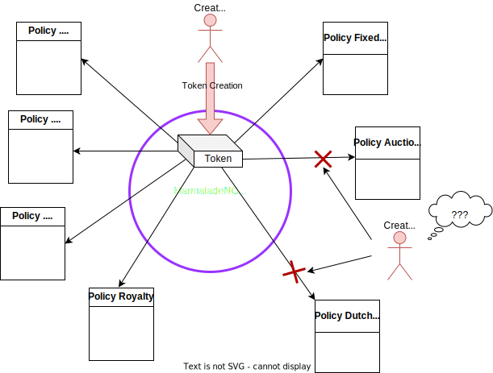
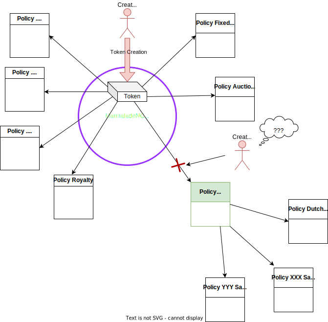
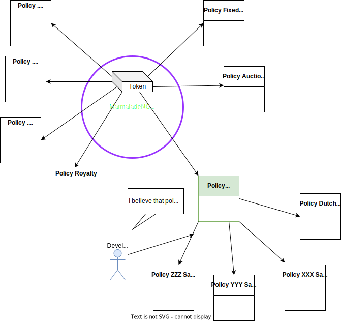
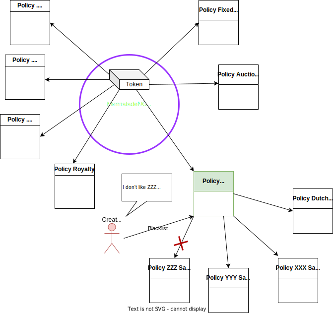

# Marmalade-NG  - Whitelisted Policies

## Intro

This papers presents how the "Whitelisted Policies" feature could be implemented for **Marmalade NG**.

The "Whitelisted Policies" feature will use the proxy-pattern using a specific policy, for maximum flexibility.

The feature allows the community to add policies that are automatically linked to all tokens. Allowing new safe and fair sales mechanisms and features to be deployed automatically.

## Current Marmalade-NG operations

Currently, when a **Creator** creates a token, he has to decide which policies to link to his token.

This choice is made at creation and can't be changed later.

As such, tokens cannot benefit from newly developed features.

## Implementation on NG

A new standard policy is created called **policy-community**. *(not sure than the name is relevant, open to better  suggestions)*

This policy is a "proxy policy". Its role is to serves as a proxy to a list of whitelisted policies. When called from  the ledger, the **policy-community** delegates and calls the whitelisted policies.

The existing **policy-fixed-price**, and **policy-auction** are kept as standard policies.

Including the **policy-community** is optional but recommended.

### At token creation:

**Creator** link the **policy-community**. As a consequence, his token immediately implements the already existing whitelisted policies. Here:

- Dutch Auction Sale
- XXX Sale
- YYY Sale

### Developpers / Comunity add a new whitelisted policy

The devellopers / Community register the new policy.

Automatically, all existing tokens can use the new **ZZZ sale policy**.

### If Creator doesn't agree

Even is the new policy is accepted by the community, **Creator** may refuse to allow the new policy to be used with his tokens.
The **policy-community** includes a per token blacklist (empty by default).
**Creator** can disable a specific (or several) whitelisted policy for his token.

## Conclusion

The implementation using a *Proxy pattern* that includes a blacklist is very straightforward.

It gives flexibility to the creator:

- Most conservatives creators who want to have full control on their tokens will only enable (or not) standards **policy-fixed-price** and **policy-auction**

- Open-minded creators who trust the community will simply enable the **policy-community**.

- Proactive creators will enable the **policy-community** to benefit from innovations, but will keep an eye of what happens, to eventually disable some policies they don't like.
